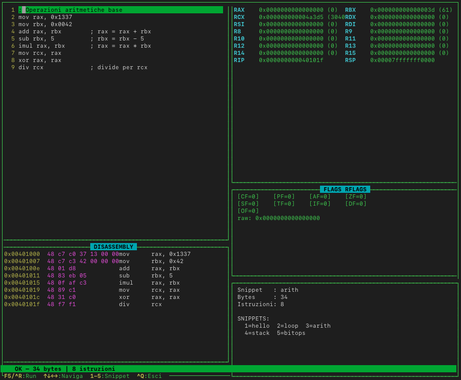

## install

pythn3 -m venv editvm

pip install keystone-engine capstone

## Usage

python3 asm_forge.py

## Keybindings

F5 o Ctrl+R Assembla + simula / Assemble + simulate

1 Snippet: syscall write

2 Snippet: loop con contatore / loop with counter

3 Snippet: operazioni aritmetiche / arithmetic operations

4 Snippet: push/pop stack

5 Snippet: bitwise ops

Ctrl+Q Esci / quit

